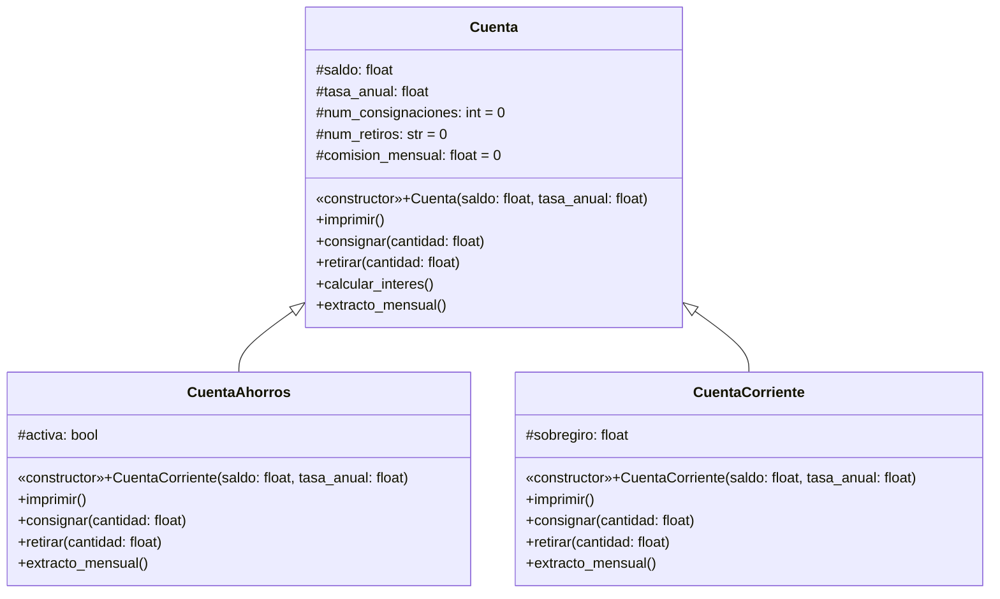
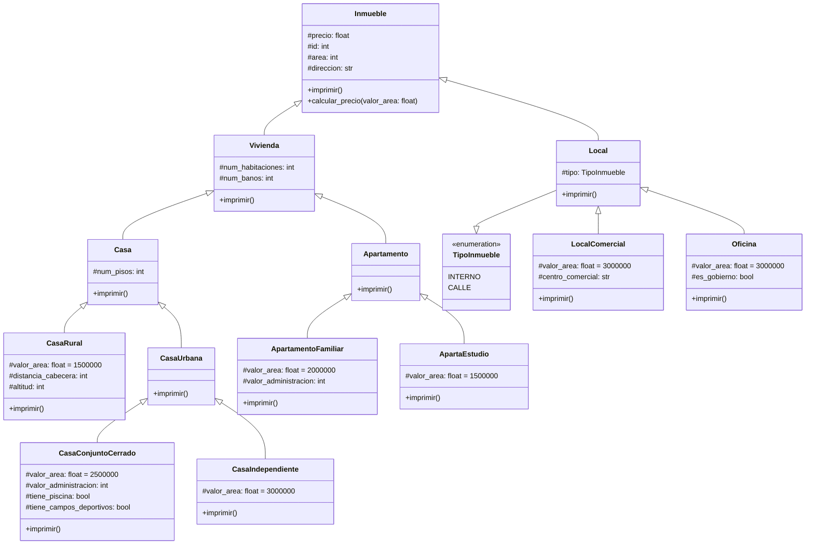

## Ejercicio 4.1. Herencia (p.194)

### Enunciado

Desarrollar un programa que modele una cuenta bancaria que tiene los siguientes atributos, que deben ser de acceso protegido:
- Saldo, de tipo float.
- Número de consignaciones con valor inicial cero, de tipo `int`.
- Número de retiros con valor inicial cero, de tipo `int`.
- Tasa anual (porcentaje), de tipo `float`.
- Comisión mensual con valor inicial cero, de tipo `float`.

La clase `Cuenta` tiene un constructor que inicializa los atributos saldo y tasa anual con valores pasados como parámetros. La clase `Cuenta` tiene los siguientes métodos:
- Consignar una cantidad de dinero en la cuenta actualizando su saldo.
- Retirar una cantidad de dinero en la cuenta actualizando su saldo. El valor a retirar no debe superar el saldo.
- Calcular el interés mensual de la cuenta y actualiza el saldo correspondiente.
- Extracto mensual: actualiza el saldo restándole la comisión mensual y calculando el interés mensual correspondiente (invoca el método
anterior).
- Imprimir: muestra en pantalla los valores de los atributos.

La clase `Cuenta` tiene dos clases hijas:
- **Cuenta de ahorros**: posee un atributo para determinar si la cuenta de ahorros está activa (tipo `boolean`). Si el saldo es menor a \$10.000, la cuenta está inactiva, en caso contrario se considera activa. Los siguientes métodos se redefinen:
  - Consignar: se puede consignar dinero si la cuenta está activa. Debe invocar al método heredado.
  - Retirar: es posible retirar dinero si la cuenta está activa. Debe invocar al método heredado.
  - Extracto mensual: si el número de retiros es mayor que 4, por cada retiro adicional, se cobra \$1000 como comisión mensual. Al generar el extracto, se determina si la cuenta está activa o no con el saldo.
  - Un nuevo método imprimir que muestra en pantalla el saldo de la cuenta, la comisión mensual y el número de transacciones realizadas (suma de cantidad de consignaciones y retiros).
- **Cuenta corriente**: posee un atributo de sobregiro, el cual se inicializa en cero. Se redefinen los siguientes métodos:
  - Retirar: se retira dinero de la cuenta actualizando su saldo. Se puede retirar dinero superior al saldo. El dinero que se debe queda
como sobregiro.
  - Consignar: invoca al método heredado. Si hay sobregiro, la
cantidad consignada reduce el sobregiro.
  - Extracto mensual: invoca al método heredado.
  - Un nuevo método imprimir que muestra en pantalla el saldo de la cuenta, la comisión mensual, el número de transacciones realizadas (suma de cantidad de consignaciones y retiros) y el valor de sobregiro.
Realizar un método main que implemente un objeto Cuenta de ahorros y llame a los métodos correspondientes

### Diagrama de Clases



### Solución


```python
class Cuenta:
    _num_consignaciones: int = 0
    _num_retiros: int = 0
    _comision_mensual: float = 0.0

    def __init__(self, saldo: float, tasa_anual: float):
        self._saldo = saldo
        self._tasa_anual = tasa_anual

    def imprimir(self):
        """Método que imprime en consola el par nombre:valor de todos los atributos de la instancia"""
        for key, val in self.__dict__.items():
            print(f"{key}: {val}")
    
    def consignar(self, cantidad: float):
        """Incrementa el `saldo` actual de la cuenta según la `cantidad` especificada.

        Args:
            cantidad (float): cantidad > 0 de dinero a sumarle al `saldo` actual.
        """
        if cantidad > 0:
            self._saldo += cantidad
            self._num_consignaciones += 1
            print(f"Se ha consignado ${cantidad}. El nuevo saldo es: ${self._saldo}")
        else:
            print("El valor a consignar debe ser mayor a cero.")
    
    def retirar(self, cantidad: float):
        """Decrementa el `saldo` actual de la cuenta según la `cantidad` especificada.

        Args:
            cantidad (float): cantidad > 0 de dinero a restarle al `saldo` actual.
        """

        if cantidad > 0 and cantidad <= self._saldo:
            self._saldo -= cantidad
            self._num_retiros += 1
            print(f"Se ha retirado ${cantidad}. El nuevo saldo es: ${self._saldo}")
        else:
            print("El valor a retirar debe ser mayor a cero y menor o igual al saldo actual.")
        
    def calcular_interes(self):
        """Calcula y suma el interés o rendimiento mensual al `saldo` actual de la cuenta."""
        tasa_mensual = self._tasa_anual / 12
        intereses = self._saldo * tasa_mensual
        self._saldo += intereses

    def extracto_mensual(self):
        """- Resta al `saldo` actual la `comision_mensual`.
        - Realiza el calculo del rendimiento mensual y lo suma al `saldo` actual."""
        self._saldo -= self._comision_mensual
        self.calcular_interes()

class CuentaAhorros(Cuenta):

    def __init__(self, saldo: float, tasa_anual: float):
        super().__init__(saldo, tasa_anual)

        if self._saldo > 10000:
            self._activa = True
        else:
            self._activa = False

    def imprimir(self):
        print("-" * 48)
        print(f"Saldo de la cuenta: ${self._saldo}")
        print(f"Comisión mensual: ${self._comision_mensual}")
        print(f"Número de transacciones: {self._num_consignaciones + self._num_retiros}")
        print("-" * 48)

    def consignar(self, cantidad: float):
        if self._activa:
            super().consignar(cantidad)
        else:
            print("La cuenta no está activa. No se puede consignar dinero.")

    def retirar(self, cantidad: float):
        if self._activa:
            super().retirar(cantidad)
        else:
            print("La cuenta no está activa. No se puede retirar dinero.")
    
    def extracto_mensual(self):
        if self._num_retiros > 4:
            retiros_extra = self._num_retiros - 4
            self._comision_mensual += retiros_extra * 1000
        
        super().extracto_mensual()

        if self._saldo < 10000:
            self._activa = False
            print("La cuenta ha sido desactivada por saldo insuficiente.")
    

class CuentaCorriente(Cuenta):
    def __init__(self, saldo: float, tasa_anual: float):
        super().__init__(saldo, tasa_anual)
        self._sobregiro: float = 0.0

    def imprimir(self):
        print("-" * 48)
        print(f"Saldo de la cuenta: ${self._saldo}")
        print(f"Comisión mensual: ${self._comision_mensual}")
        print(f"Número de transacciones: {self._num_consignaciones + self._num_retiros}")
        print(f"Valor de sobregiro: {self._num_consignaciones + self._num_retiros}")
        print("-" * 48)

    def retirar(self, cantidad):
        if cantidad > self._saldo:
            self._sobregiro = cantidad - self._saldo
            self._saldo = 0
            
            print("Se ha aplicado una comisión por sobregiro.")
        else:
            super().retirar(cantidad)
        
    def consignar(self, cantidad: float):
        if self._sobregiro > 0:
            cantidad_restante = cantidad - self._sobregiro
            if cantidad_restante > 0:
                self._sobregiro = 0
                super().consignar(cantidad_restante)
            else:
                self._sobregiro =- cantidad
        else:
            super().consignar(cantidad)

    def extracto_mensual(self):
        super().extracto_mensual()


if __name__ == "__main__":

    print("Sistema de Creación de Cuenta Bancaria (Ahorros)")

    mi_saldo_inicial = float(input("Ingrese el saldo inicial"))
    mi_tasa_anual = float(input("Ingrese la tasa anual"))

    mi_cuenta = CuentaAhorros(mi_saldo_inicial, mi_tasa_anual)
    mi_cuenta.imprimir()

    valor_consignacion = float(input("Ingrese el valor a consignar"))
    mi_cuenta.consignar(valor_consignacion)

    valor_retiro = float(input("Ingrese el valor a retirar"))
    mi_cuenta.retirar(valor_retiro)

    mi_cuenta.extracto_mensual()
    mi_cuenta.imprimir()
```

    Sistema de Creación de Cuenta Bancaria (Ahorros)
    ------------------------------------------------
    Saldo de la cuenta: $100000.0
    Comisión mensual: $0.0
    Número de transacciones: 0
    ------------------------------------------------
    Se ha consignado $50000.0. El nuevo saldo es: $150000.0
    Se ha retirado $70000.0. El nuevo saldo es: $80000.0
    ------------------------------------------------
    Saldo de la cuenta: $80666.66666666667
    Comisión mensual: $0.0
    Número de transacciones: 2
    ------------------------------------------------
    

## Ejercicio 4.2 (p. 206)

### Enunciado

Se requiere realizar un programa que modele diferentes tipos de inmuebles.
Cada inmueble tiene los siguientes atributos: identificador inmobiliario (tipo entero); área en metros cuadrados (tipo entero) y dirección (tipo String).

Los inmuebles para vivienda pueden ser casas o apartamentos. Los inmuebles para vivienda tienen los siguientes atributos: número de habitaciones y número de baños. Las casas pueden ser casas rurales o casas urbanas,
su atributo es la cantidad de pisos que poseen. Los atributos de casas rurales son la distancia a la cabecera municipal y la altitud sobre el nivel del mar.Las casas urbanas pueden estar en un conjunto cerrado o ser independientes. A su vez, las casas en conjunto cerrado tienen como atributo el valor de la administración y si incluyen o no áreas comunes como piscinas y campos deportivos. De otro lado, los apartamentos pueden ser apartaestudios
o apartamentos familiares. Los apartamentos pagan un valor de administración, mientras que los apartaestudios tienen una sola habitación.

Los locales se clasifican en locales comerciales y oficinas. Los locales
tienen como atributo su localización (si es interno o da a la calle). Los locales comerciales tienen un atributo para conocer el centro comercial donde
están establecidos. Las oficinas tienen como atributo un valor boolean para
determinar si son del Gobierno. Cada inmueble tiene un valor de compra.
Este depende del área de cada inmueble según la tabla 4.2.


Tabla 4.2. Valor por metro cuadrado según tipo de inmueble

| Inmueble                 | Valor por metro cuadrado |
|--                        |--                        |
| Casa rural               | \$ 1 500 000             |
| Casa en conjunto cerrado | \$ 2 500 000             |
| Casa independiente       | \$ 3 000 000             |
| Apartaestudio            | \$ 1 500 000             |
| Apartamento familiar     | \$ 2 000 000             |
| Local comercial          | \$ 3 000 000             |
| Oficina                  | \$ 3 500 000             |

### Diagrama de Clase



### Solución


```python
from enum import Enum, auto

class Inmueble:
    _precio: float

    def __init__(self, id: int, area: int, direccion: str):
        self._id = id
        self._area = area
        self._direccion = direccion
    
    def imprimir(self):
        print(f"Identificador del inmueble: {self._id}")
        print(f"Area del inmueble: {self._area}")
        print(f"Dirección del inmueble: {self._direccion}")
        print(f"Precio de venta: ${self._precio}")
    
    def calcular_precio(self, valor_area: float):
        """Método que calcula el precio del inmueble según su `area` y lo asigna al atributo `precio`"""
        self._precio = self._area * valor_area

class Vivienda(Inmueble):
    
    def __init__(self, id: int, area: int, direccion: str, num_habitaciones: int, num_banos: int):
        super().__init__(id, area, direccion)
        self._num_habitaciones = num_habitaciones
        self._num_banos = num_banos
    
    def imprimir(self):
        super().imprimir()
        print("-" * 48)
        print(f"Número de habitaciones: {self._num_habitaciones}")
        print(f"Número de baños: {self._num_banos}")

class Casa(Vivienda):
    
    def __init__(self, id: int, area: int, direccion: str, num_habitaciones: int, num_banos: int, num_pisos: int):
        super().__init__(id, area, direccion, num_habitaciones, num_banos)
        self._num_pisos = num_pisos
    
    def imprimir(self):
        print("-" * 48)
        print(f"Número de pisos: {self._num_pisos}")
        print("-" * 48)

class Apartamento(Vivienda):
    
    def __init__(self, id: int, area: int, direccion: str, num_habitaciones: int, num_banos: int):
        super().__init__(id, area, direccion, num_habitaciones, num_banos)
    
    def imprimir(self):
        super().imprimir()

class CasaRural(Casa):
    _valor_area: float = 1500000
    _distancia_cabecera: int
    _altitud: int
    
    def __init__(self, id: int, area: int, direccion: str, num_habitaciones: int, num_banos: int, num_pisos: int, distancia_cabecera: int, altitud: int):
        super().__init__(id, area, direccion, num_habitaciones, num_banos, num_pisos)
        self._distancia_cabecera = distancia_cabecera
        self._altitud = altitud
    
    def imprimir(self):
        super().imprimir()
        print("-" * 48)
        print(f"Distancia a la cabecera municipal: {self._distancia_cabecera}")
        print(f"Altitud sobre nivel del mar: {self._altitud}")
        print("-" * 48)
    
class CasaUrbana(Casa):
    
    def __init__(self, id: int, area: int, direccion: str, num_habitaciones: int, num_banos: int, num_pisos: int):
        super().__init__(id, area, direccion, num_habitaciones, num_banos, num_pisos)
    
    def imprimir(self):
        super().imprimir()

class ApartamentoFamiliar(Apartamento):
    _valor_area: float = 2000000
    _valor_administracion: int
    
    def __init__(self, id: int, area: int, direccion: str, num_habitaciones: int, num_banos: int, valor_administracion: int):
        super().__init__(id, area, direccion, num_habitaciones, num_banos)
        self._valor_administracion = valor_administracion
    
    def imprimir(self):
        super().imprimir()
        print("-" * 48)
        print(f"Valor de la administración: ${self._valor_administracion}")
        print("-" * 48)

class ApartaEstudio(Apartamento):
    _valor_area: float = 1500000
    
    def __init__(self, id: int, area: int, direccion: str, num_habitaciones: int, num_banos: int):
        super().__init__(id, area, direccion, num_habitaciones, num_banos)
    
    def imprimir(self):
        super().imprimir()

class CasaConjuntoCerrado(CasaUrbana):
    _valor_area: float = 2500000
    _valor_administracion: int
    _tiene_piscina: bool
    _tiene_campos_deportivos: bool
    
    def __init__(self, id: int, area: int, direccion: str, num_habitaciones: int, num_banos: int, num_pisos: int, valor_administracion: int, tiene_piscina: bool, tiene_campos_deportivos: bool):
        super().__init__(id, area, direccion, num_habitaciones, num_banos, num_pisos)
        self._valor_administracion = valor_administracion
        self._tiene_piscina = tiene_piscina
        self._tiene_campos_deportivos = tiene_campos_deportivos
    
    def imprimir(self):
        super().imprimir()
        print("-" * 48)
        print(f"Valor de la administración: {self._valor_administracion}")
        print(f"Tiene piscina?: {self._tiene_piscina}")
        print(f"Tiene campos deportivos?: {self._tiene_campos_deportivos}")

class CasaIndependiente(CasaUrbana):
    _valor_area: float = 3000000
    
    def __init__(self, id: int, area: int, direccion: str, num_habitaciones: int, num_banos: int, num_pisos: int):
        super().__init__(id, area, direccion, num_habitaciones, num_banos, num_pisos)
    
    def imprimir(self):
        super().imprimir()

class TipoInmueble(Enum):
    INTERNO = auto()
    CALLE = auto()

class Local(Inmueble):
    _tipo: TipoInmueble
    
    def __init__(self, id: int, area: int, direccion: str, tipo_local: TipoInmueble):
        super().__init__(id, area, direccion)
        self._tipo = tipo_local
    
    def imprimir(self):
        super().imprimir()
        print("-" * 48)
        print(f"Tipo de local: {self._tipo}")
        print("-" * 48)

class LocalComercial(Local):
    _valor_area: float = 3000000
    _centro_comercial: str

    def __init__(self, id: int, area: int, direccion: str, tipo_local: TipoInmueble, centro_comercial: str):
        super.__init__(id, area, direccion, tipo_local)
        self._centro_comercial = centro_comercial

    def imprimir(self):
        super().imprimir()
        print("-" * 48)
        print(f"Centro comercial: {self._centro_comercial}")
        print("-" * 48)

class Oficina(Local):
    _valor_area: float = 3000000
    _es_gobierno: bool

    def __init__(self, id: int, area: int, direccion: str, tipo_local: TipoInmueble, es_gobierno: bool):
        super.__init__(id, area, direccion, tipo_local)
        self._es_gobierno = es_gobierno

    def imprimir(self):
        super().imprimir()
        print("-" * 48)
        print(f"Es oficina gubernamental: {self._es_gobierno}")
        print("-" * 48)


if __name__ == "__main__":
    mi_apto_familiar = ApartamentoFamiliar(103067, 120, "Avenida Santander 45-45", 3, 2, 200000)
    print("Datos Apartamento Familiar")
    mi_apto_familiar.calcular_precio(mi_apto_familiar._valor_area)
    mi_apto_familiar.imprimir()

    print()

    print("Datos Apartaestudio")
    mi_apt_estudio = ApartaEstudio(12354,50,"Avenida Caracas 30-15",1,1)
    mi_apt_estudio.calcular_precio(mi_apt_estudio._valor_area)
    mi_apt_estudio.imprimir()
```

    Datos Apartamento Familiar
    Identificador del inmueble: 103067
    Area del inmueble: 120
    Dirección del inmueble: Avenida Santander 45-45
    Precio de venta: $240000000
    ------------------------------------------------
    Número de habitaciones: 3
    Número de baños: 2
    ------------------------------------------------
    Valor de la administración: $200000
    ------------------------------------------------
    
    Datos Apartaestudio
    Identificador del inmueble: 12354
    Area del inmueble: 50
    Dirección del inmueble: Avenida Caracas 30-15
    Precio de venta: $75000000
    ------------------------------------------------
    Número de habitaciones: 1
    Número de baños: 1
    
